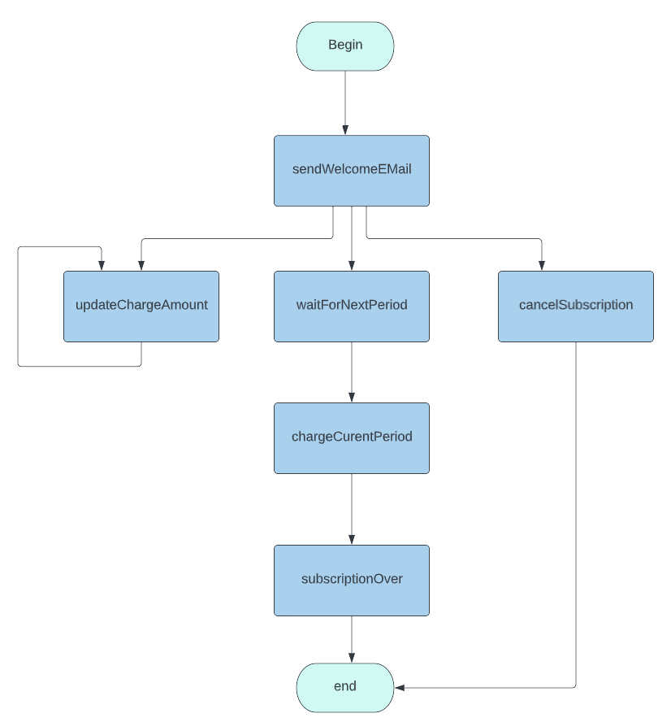

## Subscription workflow

This is an [example](https://github.com/longquanzheng/iwf/blob/main/src/com/indeed/iwf/demo/subscription) as a
translation of the [ Subscription workflow](https://cadenceworkflow.io/docs/concepts/workflows/#example)

Based on the workflow definition, a diagram can be drawn easily to illustrate the flow.

